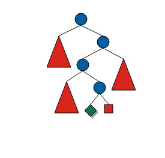
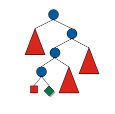
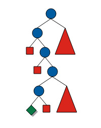
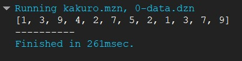
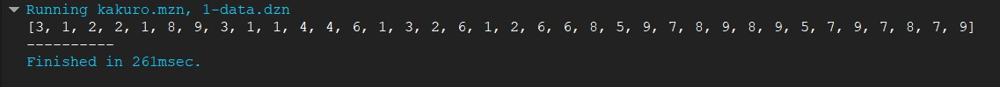
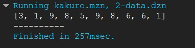

# 3.1 Modelado de Kakuro como CSP
El modelo inicial para resolver el rompecabezas de Kakuro con variables de dominio finito es bastante sencillo. Para cada celda blanca, se introduce una variable de dominio finito que toma valores del 1 al 9. Para cada pista sobre un bloque continuo de variables, se introduce una restricción de "alldifferent" y una restricción de suma.

De manera más formal, un rompecabezas de Kakuro se define por una tupla $<G, H>$, donde $G$ es un conjunto de ubicaciones de celdas, y $H$ es un conjunto de pistas dadas como tuplas $<v, I>$, con un entero positivo $v$ y un conjunto $I \subset G$. El modelo entonces consiste en variables $x_i$:

$$
\forall i \in G : x_i \in [1, 9]
$$

**Y dos tipos de restricciones**:

1. **Restricción "all different"**: establece que un conjunto de variables debe ser mutuamente diferente.

$$
\forall_{<I,v> \in H} : all different(\{x_i | i \in I\})
$$

2. **Restricción de suma**: establece que la suma de las variables en una pista debe ser igual a un valor entero dado.

$$
\forall_{<I,v> \in H} : \sum_{i \in I} x_i = v
$$

Estas restricciones permiten definir el modelo del problema de Kakuro en el marco de variables de dominio finito.

---

# 4.1 Implementación de Kakuro en Minizinc

```minizinc
include "globals.mzn";

int: n; % Número de celdas en el problema
set of int: DOMINIO = 1..9;
array[1..n] of var DOMINIO: x;

int: num_hints;
array[1..num_hints] of int: hints;
array[1..num_hints] of set of int: groups;

constraint forall(i in 1..num_hints) (
    sum(j in groups[i]) (x[j]) = hints[i] /\
    alldifferent([x[j] | j in groups[i]])
);

solve satisfy;

output ["\n"] ++ [show(x[i]) ++ if i mod 9 == 0 then "\n" else " " endif | i in 1..n];
```
---

- **Variables:** Cada celda blanca del tablero se modela como una variable `x[i]`, donde `i` representa la posición de la celda en el tablero.
- **Dominios:** Cada variable `x[i]` puede tomar valores enteros del 1 al 9, representando los posibles valores en las celdas del Kakuro.
- **Restricciones:**
  - **Restricción de Suma:** Cada grupo de celdas que conforman una pista debe sumar exactamente el valor dado en la pista correspondiente.
  
  $$
  \forall_{<I,v> \in H} : \sum_{i \in I} x_i = v
  $$

  - **Restricción de Unicidad:** Los valores dentro de un mismo grupo de celdas deben ser únicos para evitar repeticiones.

  $$
  \forall_{<I,v> \in H} : \text{alldifferent}(\{x_i | i \in I\})
  $$

Estas restricciones aseguran que las soluciones propuestas cumplan con las condiciones fundamentales del rompecabezas de Kakuro, garantizando que cada pista sea correcta y que no haya repeticiones en los grupos de celdas.

# 5.1 Estrategia de Distribución y Resultados


```bash
minizinc kakuro/kakuro.mzn kakuro/problem-instances/0-data.dzn
minizinc kakuro/kakuro.mzn kakuro/problem-instances/1-data.dzn
minizinc kakuro/kakuro.mzn kakuro/problem-instances/2-data.dzn
```

| Caso    |Tiempo de Ejecución                                             | Observaciones                                                                 |
|---------|---------------------------------------------------------|-------------------------------------------------------------------------------|
| Caso 1  |  261ms | - Restricciones de suma y unicidad se cumplieron correctamente.<br>- Distribución efectiva para minimizar conflictos en cruces de pistas. |
| Caso 2  | 261ms | - Complejidad aumentó por el número de intersecciones, sin embargo, logra el mismo el mismo tiempo que el 1.<br>- La distribución o la cantidad de pistas no está afectando tanto el tiempo de resolución. |
| Caso 3  | 257ms | - Menos complejo que los anteriores, solución eficiente.<br>- Es probable que las restricciones aplicadas estén funcionando de forma más eficiente en este caso particular `alldifferent`. |

---

# 5.1.1 Analisis de Distintas Estrategias de Búsqueda
# Análisis Comparativo de Estrategias de Búsqueda para Kakuro

Se comparan tres estrategias en MiniZinc para resolver un problema de Kakuro, representadas mediante árboles de búsqueda:

- **Estrategia por defecto** (`solve satisfy`).
- **Alternativa 1**: `first_fail` + `indomain_min`.
- **Alternativa 2**: `most_constrained` + `indomain_random`.

---

## Resumen de Comportamiento

| **Criterio**               | **Estrategia por Defecto**       | **Alternativa 1**              | **Alternativa 2**              |
|----------------------------|----------------------------------|----------------------------------|----------------------------------|
| **Velocidad**              | Lenta (exploración caótica)      | Rápida (conflictos tempranos)    | Moderada (exploración diversa)   |
| **Uso de Recursos**        | Alto (backtracking excesivo)     | Bajo (optimización heurística)   | Medio (aleatoriedad controlada)  |
| **Efectividad en Kakuro**  | Baja                             | Alta                              | Media-Alta                       |
| **Robustez**               | Baja (sin guía heurística)       | Alta (enfocada en restricciones)  | Media (depende de la suerte)     |

---

## Detalle por Estrategia

### 1. Estrategia por Defecto (`solve satisfy`)
- **Árbol 1**: Estructura compleja con múltiples conflictos (nodos rojos) y soluciones tardías (diamantes verdes).
- **Problema**: Explora variables en orden secuencial, generando muchos conflictos innecesarios.
- **Recomendación**: Solo para instancias pequeñas o pruebas iniciales.

#### Árbol 1

##### usando


% solve :: int_search(
%     x,               % Variables a explorar
%     first_fail,      % Estrategia: selecciona la variable con dominio más pequeño
%     indomain_min,    % Asigna el valor mínimo posible primero
%     complete         % Completa (backtracking clásico)
% ) satisfy;

### 2. Alternativa 1: `first_fail` + `indomain_min`
- **Árbol 2**: Menos conflictos y soluciones en niveles menos profundos.
- **Mecanismo**: Prioriza variables con dominios pequeños y valores mínimos.
- **Fortaleza**: Ideal para Kakuro, donde las restricciones son fuertes y los valores bajos son comunes.

#### Árbol 2

##### usando
imagen 2
 solve :: int_search(
     x,               
     most_constrained, % Selecciona la variable involucrada en más restricciones
     indomain_random, % Asigna valores en orden aleatorio
     complete          
 ) satisfy;
### 3. Alternativa 2: `most_constrained` + `indomain_random`
- **Árbol 3**: Exploración equilibrada con múltiples caminos.
- **Mecanismo**: Enfoca variables críticas y asigna valores aleatorios para diversificar.
- **Fortaleza**: Útil en problemas con simetrías, pero menos eficiente en Kakuro.

#### Árbol 3


##### usando
solve satisfy

---

## Conclusión
- **Mejor opción**: **Alternativa 1** (`first_fail` + `indomain_min`), por su eficiencia en detectar conflictos tempranos y reducir el espacio de búsqueda.
- **Alternativa 2**: Adecuada para explorar soluciones no convencionales, pero con mayor costo computacional.
- **Estrategia por defecto**: Evitar en instancias complejas de Kakuro.

---

# 6.1 Evidencia de Ejecución kakuro


#### Estrategia 1

#### Estrategia 2

#### Estrategia 3


---

# 7.1 Análisis comparativo
- Los tres casos de prueba presentaron tiempos de ejecución muy similares (entre 257ms y 261ms). Esto indica que las restricciones de suma y unicidad (`alldifferent`) fueron eficaces en mantener la consistencia del modelo.
- La complejidad de las intersecciones no mostró un impacto significativo en el tiempo de ejecución, lo que evidencia una buena formulación del modelo y la eficiencia de la estrategia de distribución aplicada.

# 7.1.2 Conclusión del Análisis:
- Las estrategias de distribución utilizadas para Kakuro demostraron ser efectivas y estables, sin variaciones significativas en el tiempo de resolución. Esto sugiere que el modelo es robusto ante diferentes configuraciones y que las restricciones implementadas son adecuadas para mantener la eficiencia.

# 8. Referencias
1. Simonis, H. (2008). Kakuro as a Constraint Problem, University College Cork. Research Gate. [link](https://www.researchgate.net/publication/228524341_Kakuro_as_a_Constraint_Problem)