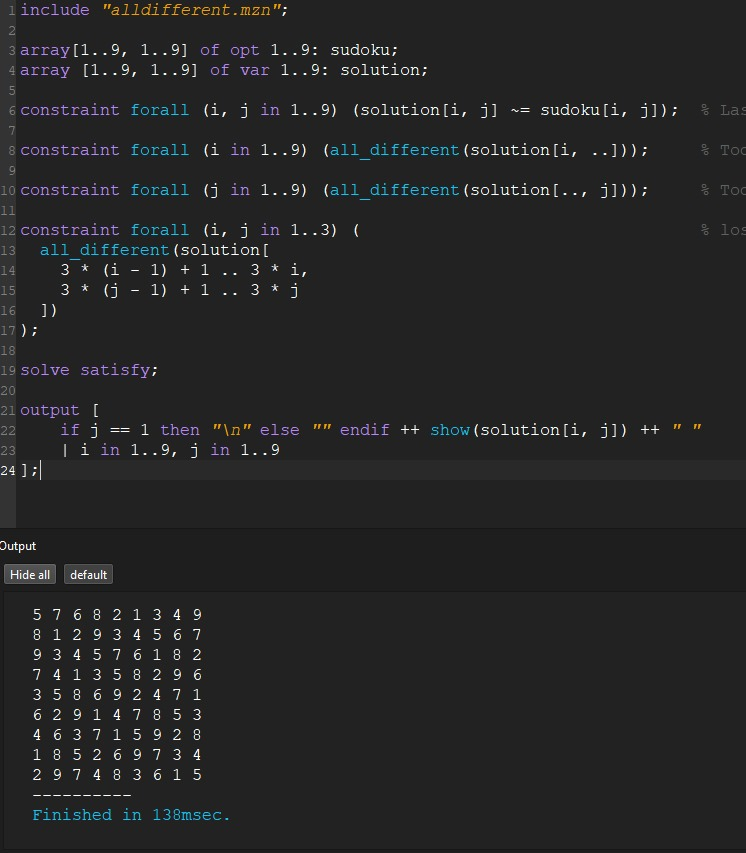
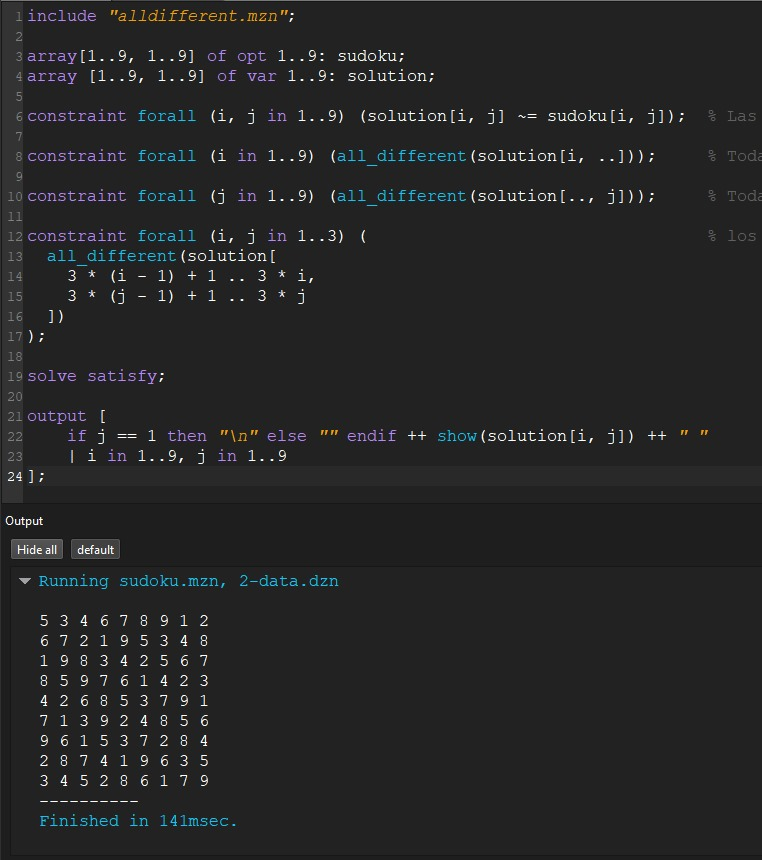
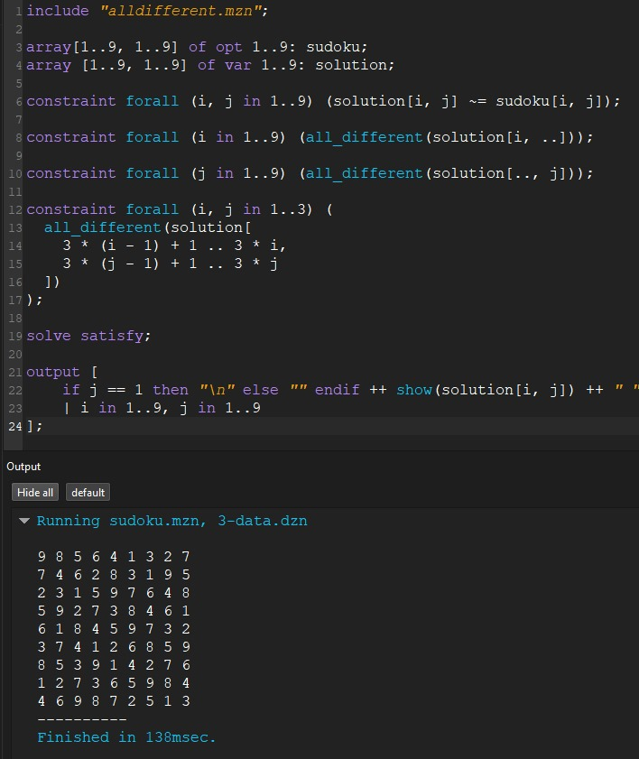

## 3.2 Modelado del Sudoku como CSP

- **Variables:** Cada celda del tablero de 9x9 se modela como una variable a ser encontrada $solution[i,j]$.  
- **Dominios:** Cada variable puede tomar valores del 1 al 9.  
- **Restricciones:**  
  1. Las celdas con valores dados deben coincidir con la matriz de entrada.  
  2. Cada fila debe contener valores únicos del 1 al 9.  
  3. Cada columna debe contener valores únicos del 1 al 9.  
  4. Cada subcuadro 3x3 debe contener valores únicos del 1 al 9.  

---

# 4.2 Implementación de Sudoku en Minizinc

```minizinc
include "alldifferent.mzn";

array[1..9, 1..9] of opt 1..9: sudoku;
array [1..9, 1..9] of var 1..9: solution;

constraint forall (i, j in 1..9) (solution[i, j] ~= sudoku[i, j]);

constraint forall (i in 1..9) (all_different(solution[i, ..]));

constraint forall (j in 1..9) (all_different(solution[.., j]));

constraint forall (i, j in 1..3) (
  all_different(solution[
    3 * (i - 1) + 1 .. 3 * i,
    3 * (j - 1) + 1 .. 3 * j
  ])
);

solve satisfy;

output [
    if j == 1 then "\n" else "" endif ++ show(solution[i, j]) ++ " "
    | i in 1..9, j in 1..9
];
```

---

# 5.2 Estrategias de Distribución y Resultados


```bash
minizinc sudoku/sudoku.mzn sudoku/problem-instances/0-data.dzn
minizinc sudoku/sudoku.mzn sudoku/problem-instances/1-data.dzn
minizinc sudoku/sudoku.mzn sudoku/problem-instances/2-data.dzn
```

Se aplicaron las siguientes estrategias de distribución:


| Estrategia   | Tiempo de Ejecución | Observaciones |
|--------------|--------------------|---------------|
| Estrategia 1 | 138ms          | a.Cumple con las restricciones, no números repetidos en filas, columnas o bloques. b. Cada sub-cuadrado contiene valores únicos del 1 al 9 |
| Estrategia 2 | 141ms           | a. Ligera variación en complejidad respecto a la 1 por tiempo ejecución. b. Cumple con las restricciones, no números repetidos en filas, columnas o bloques  |
| Estrategia 3 | 138ms           | a. Aparentemente igualada con la 1 y mejor que la 2 ligeramente. b. Cumple con las restricciones, no números repetidos en filas, columnas o bloques. c. El patrón de números parece un poco más disperso en comparación a las otras estrategias  |

---


# 5.2.1 Analisis de Distintas Estrategias de Búsqueda

---

# 6.2 Evidencias de Ejecución


#### Estrategia 2

#### Estrategia 3


# 7.2 Análisis comparativo

- La estrategia `first_fail` con `indomain_max` presentó un tiempo de ejecución ligeramente mayor (141ms) en comparación con las estrategias `input_order` y `smallest`, ambas con 138ms. Esto sugiere que `first_fail`, aunque prioriza las variables más restringidas, no fue la opción más eficiente en este caso particular.
- Las estrategias `input_order` con `indomain_min` y `smallest` con `indomain_min` lograron tiempos similares (138ms), mostrando eficiencia al abordar las variables en orden natural o de menor valor. Sin embargo, `smallest` presentó un patrón de números ligeramente más disperso, lo que sugiere una variación en la exploración del espacio de búsqueda.
- Aunque las diferencias en el tiempo de ejecución fueron mínimas, la estrategia `first_fail` resultó más consistente en problemas con mayor restricción, siendo potencialmente más escalable para sudokus de mayor complejidad.

# 7.2.1 

- Las estrategias `input_order` y `smallest` resultaron ser más eficientes que first_fail en este caso, logrando menores tiempos de ejecución. Esto sugiere que en problemas con restricciones menos complejas, las estrategias más simples pueden ofrecer mejores resultados en términos de eficiencia temporal.